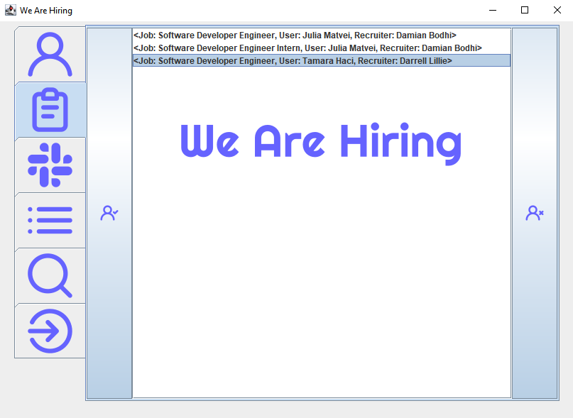

<!--- insert project logo here -->

<!--- general description of the project -->
This is the final student project for the Object-Oriented Programming course. It is a simple application designed for job applying and recruitment that reads information (Users, Recruiters and Managers) from the attached JSON files. The project follows the following  assignment [specifications]() with extra features added.

## :trophy: Features
  &nbsp;&nbsp; :small_orange_diamond: Clean and easy to use GUI  
  &nbsp;&nbsp; :small_orange_diamond: Possibility of adding additional users and companies  

## :page_facing_up: License
This project is available under the [MIT][ref-mit] license; see [LICENSE](LICENSE) for the full license text.
This project also includes external libraries that are available under a variety of licenses; see [LEGAL.txt](LEGAL.txt)
for the full license texts and legal notices.

<!--- add link references here -->
[ref-mit]:              https://opensource.org/licenses/MIT
